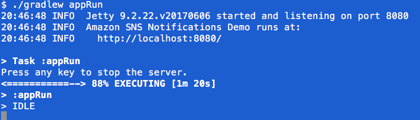
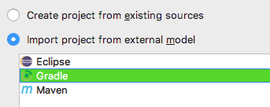
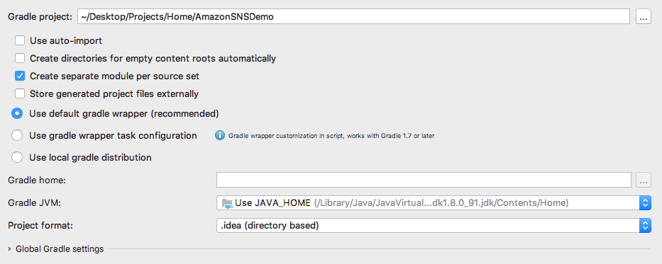
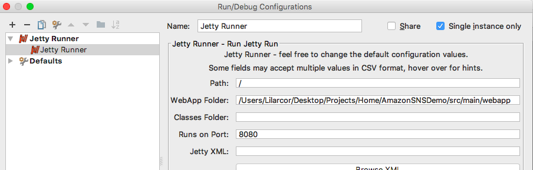
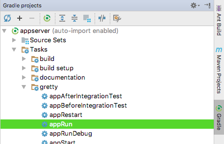

# Basic Amazon SNS integration demo for iOS and Android


--
### Introduction
This is a basic example of hooking up to Amazon SNS for registering and broadcasting push notifications to iOS and Android.

The demo is a simple JVM server written in Kotlin. The code has been kept very simple to focus on the Amazon SNS integration.

There is an expected level of understanding of mobile apps to be able to digest this. The integration of Firebase for Android and Push Notifications for Apple iOS into the mobile applications themselves is left to the user to research, but is well documented on the Google Firebase and Apple Notification developer sites.

--
### Prerequisites

1. Create an iOS application with push notifications enabled, and with an APNS certificate made. This certificate will be submitted to AWS SNS to allow it to communicate with Apple APNS on your behalf. Integrate the APNS notification lifecycle code into the iOS application.
2. Create an Android application and register it into Firebase as a new project to obtain a 'server key' which will be submitted to AWS SNS to allow it to communicate with Google GCM/Firebase on your behalf. Integrate the Firebase SDK and configuration into the Android application.
3. Create an AWS account, then create an iOS 'platform application' and an Android 'platform application' within the SNS service area.
4. Attach your Apple APNS certificate into the iOS platform application credentials in AWS SNS console.
5. Attach your Firebase server key into the Android platform application credentials in AWS SNS console.
6. Create your preferred method of credentials for communicating with AWS. See the 'Amazon.kt' source file in the repository for some basic info on how to do this.

--
### Running the server

Clone or download the repository. The demo server is Gradle based but you can use IntelliJ to open it for editing. If you wish to run the server via **Terminal** use the following Gradle command:

```
./gradlew appRun
```

> Note: the first time you run or open the project it may take a while to download all the required dependencies.

After successfully starting you should see:



--
To open the project in IntelliJ do the following:

1. Open IntelliJ and choose **Import Project**.
2. Navigate and open your cloned repository.
3. Pick settings similar to the following:





After opening the project in IntelliJ, install the **IntelliJ Jetty Runner** plugin, then create a new run profile similar to this:



You will then have a run profile that can be used to launch the server from within IntelliJ.

Also, if you wish, you can run the Gradle task **appRun** from the **Gretty** task group to launch the server:



> Opinion: The Jetty Runner plugin is much nicer to use while in IntelliJ!

--
### Demo APIs

There are only two APIs in the sample that simply illustrate registering and triggering notifications.

**Registering**

- POST
- http://localhost:8080/register
- Content-Type: application/json

```
iOS client would invoke this
{
	"platform": "ios",
	"userId": "AppleUser",
	"token": "APNS-push-token-provided-by-iOS-operating-system"
}
```
```
Android client would invoke this
{
	"platform": "android",
	"userId": "AndroidUser",
	"token": "Firebase-registration-id-provided-by-operating-system"
}
```

**Send notification**

- POST
- http://localhost:8080/send
- Content-Type: application/json

```
{
	"userId": "UserIdToTarget",
	"notificationTitle": "Title here!",
	"notificationBody": "Body here!"
}
```

--
### iOS notification integration

There are plenty of articles on the net about how to do this. Here is a super basic example of some of the common lifecycle callbacks in the main application delegate to deal with notifications (by no means exhaustive!):

```swift
import UIKit
import UserNotifications

@UIApplicationMain
class AppDelegate: UIResponder, UIApplicationDelegate {
    var window: UIWindow?
    
    func application(_ application: UIApplication, didFinishLaunchingWithOptions launchOptions: [UIApplicationLaunchOptionsKey: Any]?) -> Bool {
        if #available(iOS 10.0, *) {
            let authOptions: UNAuthorizationOptions = [.alert, .badge, .sound]
            UNUserNotificationCenter.current().requestAuthorization(options: authOptions, completionHandler: { _, _ in })
        } else {
            let settings: UIUserNotificationSettings = UIUserNotificationSettings(types: [.alert, .badge, .sound], categories: nil)
            application.registerUserNotificationSettings(settings)
        }
        
        application.registerForRemoteNotifications()
        
        // Notification data can potentially be delivered in this method too.
        
        return true
    }

    func application(_ application: UIApplication, didReceiveRemoteNotification userInfo: [AnyHashable: Any]) {
	    // Notification can be processed here
        print("NOTIFICATION RECEIVED! \(userInfo)")
    }
    
    func application(_ application: UIApplication, didRegisterForRemoteNotificationsWithDeviceToken deviceToken: Data) {
        let tokenParts = deviceToken.map { data -> String in
            return String(format: "%02.2hhx", data)
        }

        let token = tokenParts.joined()
        
        // LOOK: The token can now be sent to the app server for registration
    }

    func application(_ application: UIApplication, didFailToRegisterForRemoteNotificationsWithError error: Error) {
        print("Failed to register: \(error)")
    }
}

```

--
### Android notification integration

The documentation on Firebase runs through in fair detail how to configure an Android application: [https://firebase.google.com/docs/cloud-messaging/android/client](https://firebase.google.com/docs/cloud-messaging/android/client)
